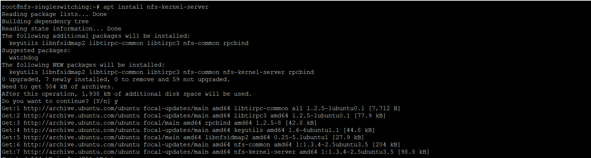
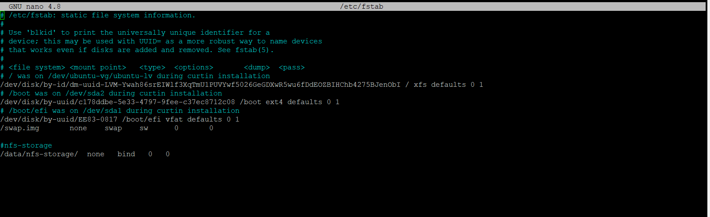
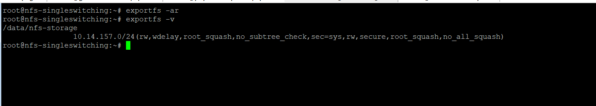

# install-nfs-server ubuntu 20.04 LTS

| HOSTNAME              | IP              | KETERANGAN            |
| :---------------------| :---------------| :---------------------|
| `nfs-singleswitching` | `10.14.157.243` | Server for NFS Server |
| `ss-worker-01`        | `10.14.157.225` | Server for NFS Client |

Installation NFS Server
## Installing the NFS server
- update & install
```bash
apt update
apt install nfs-kernel-server
```



### Creating the file systems
- create directory for storage
```bash
mkdir -p /data/nfs-storage/data
mkdir -p /data/nfs-storage/logs
```

### make the bind mounts permanent across reboots, open the /etc/fstab file
- make a config bellow in path **/etc/fstab**
```bash
/data/nfs-storage/  none   bind   0   0
```


### Exporting the file systems
```bash
nano /etc/exports
```
- add following config

```bash
/data/nfs-storage   10.14.157.0/24(rw,sync,no_subtree_check)
```
- apply config exports
```bash
exportfs -ar
exportfs -v
```



## Set Up the NFS Clients
### setup domain local first
- login into server nfs client & setup host local for communicate with nfs server bellow
```bash
nano /etc/hosts
```
```bash
10.14.157.243 nfs-singleswitching
```

- update & install 
```bash
apt update
apt install nfs-common
```

### add mounting filesystem
- create directory for sharing file
```bash
mkdir -p /mnt/nfs-storage
```
- add & sync path nfs server & nfs client
```bash
nano /etc/fstab
```
```bash
nfs-singleswitching:/data/nfs-storage /mnt/nfs-storage nfs nolock 0 0
```
- apply config
```bash
mount -a
```
- cek your mounting filesystem
```bash
df -h | grep nfs-storage
```


